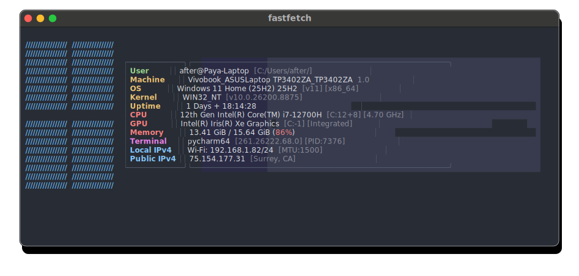
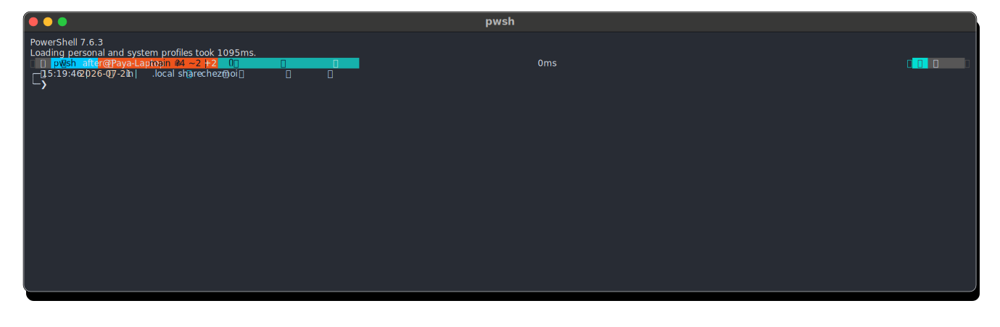
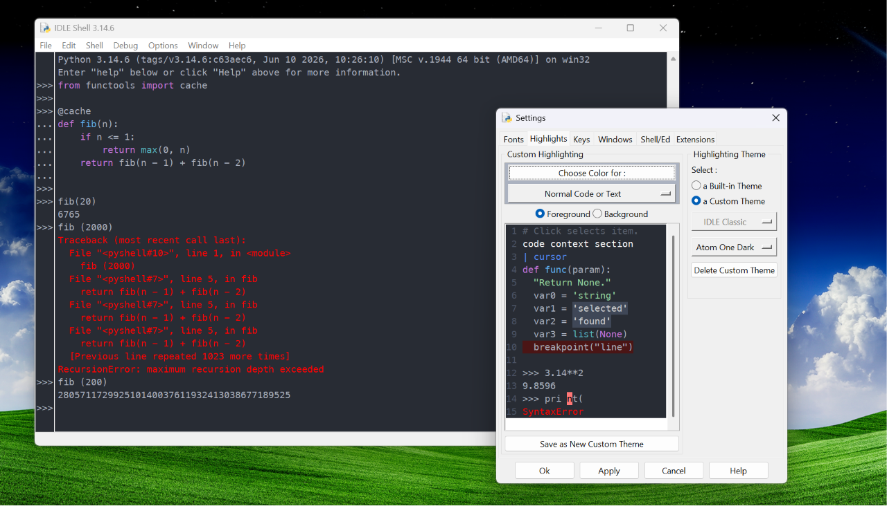
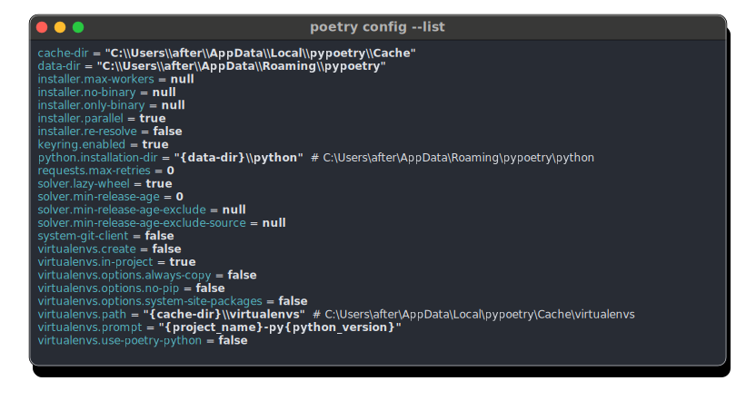
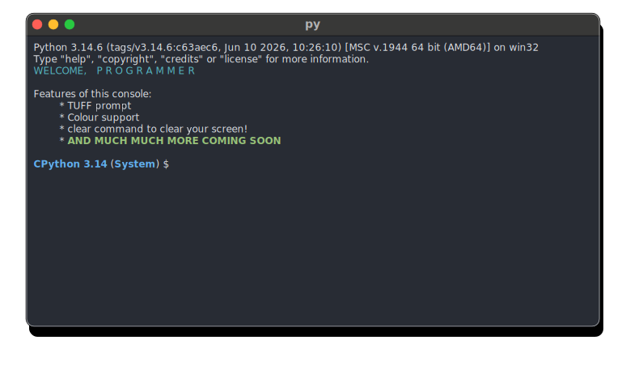
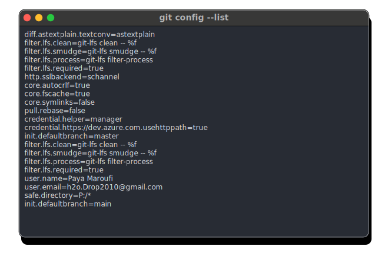
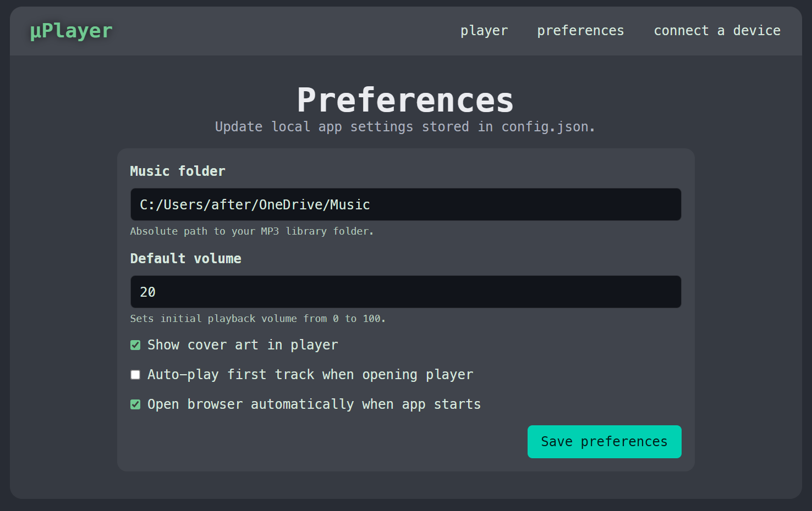

# Paya's dotfiles!

_A collection of all my config files_

I've spent a long time procrastinating working on a dotfiles repo, mostly because I was
convinced I wouldn't have enough dotfiles to commit. In addition, I had lost basically
everything from my windows home folder when my laptop's drive got corrupted while Best Buy
were "repairing" my touchpad :clown_face:. Anywho, I thought that now would be as good a time
as ever to organize some of the dotfiles I had lying around, as well as finally get around
to ricing my Arch install and some other tools I use. I also replaced my beloved `.pythonrc`
which was one of the victims to the aforementioned data wipe.

## Usage

Run the following in your terminal

### Windows (Powershell)

```powershell
powershell -NoProfile -ExecutionPolicy Bypass -Command "irm https://raw.githubusercontent.com/Tinkering-Townsperson/dotfiles/refs/heads/main/paya_dotfile_helper_WINDOWS.ps1 | iex"
```

### Linux

```shell
curl -fsSL https://raw.githubusercontent.com/Tinkering-Townsperson/dotfiles/refs/heads/main/paya_dotfile_helper_ARCH.sh | bash
```


## List of files

Screenshots of terminal were taken with `termframe`

### Ricing

- Bash ( `~/.bashrc` )
- FastFetch ( `~/.config/fastfetch/config.jsonc` )

- GhosTTY ( `~/.config/ghostty/config.ghostty` )
- Konsole ( `~/.config/.konsolerc`, `~/.local/share/konsole/One Dark.colorscheme`, `~/.local/share/konsole/Powershell 7.profile` )
- Niri ( `~/.config/niri/config.kdl` )
- Noctalia ( `~/.config/noctalia/noctalia-full-config.toml` )
- Oh My Posh ( `~/.config.omp.toml` )

- Profile Environment Variables ( `~/.profile` )
- PowerShell ( `~/Documents/Powershell/profile.ps1` or `~/.config/powershell/profile.ps1` )

### Python-related configuration files

- IDLE ( `~/.idlerc/config-main.cfg`, `~/.idlerc/config-highlight.cfg` )

- Poetry ( `~/AppData/Roaming/pypoetry/config.toml` or `~/.config/pypoetry/config.toml` )

- Python REPL ( `~/.pythonrc` )

- Twine ( `~/.pypirc` )

### Programming tools

- Git ( `~/.gitconfig` )

- Ruby ( `~/.irbrc` )
- Vim ( `~/.vimrc`, `~/vimfiles/autoload/plug.vim` or `~/.vim/autoload/plug.vim` )
- Wakatime ( `~/.wakatime.cfg` )

### Other apps

- MuseScore ( `~/AppData/Roaming/MuseScore/MuseScore4.ini` )
- PrusaSlicer ( `~/AppData/Roaming/PrusaSlicer/PrusaSlicer.ini.tmpl` )
- Vencord ( `~/AppData/Roaming/Vencord/settings/quickCss.css` or `~/.config/Vencord/settings/quickCss.css`,  `~/AppData/Roaming/Vencord/settings/settings.json` or `~/.config/Vencord/settings/settings.json`)

### Personal projects

- HCAI workbench ( `~/hcai_workbench.cfg` )
- Undertale Manager ( `~/AppData/Local/undertale_manager/config.json` )
- μPlayer ( `~/AppData/Local/mu_player/config.json` )

